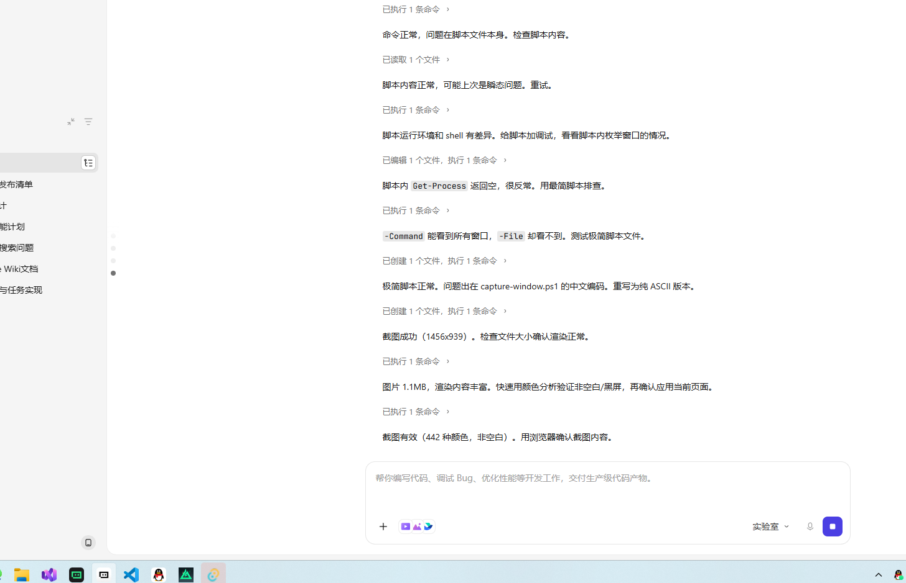
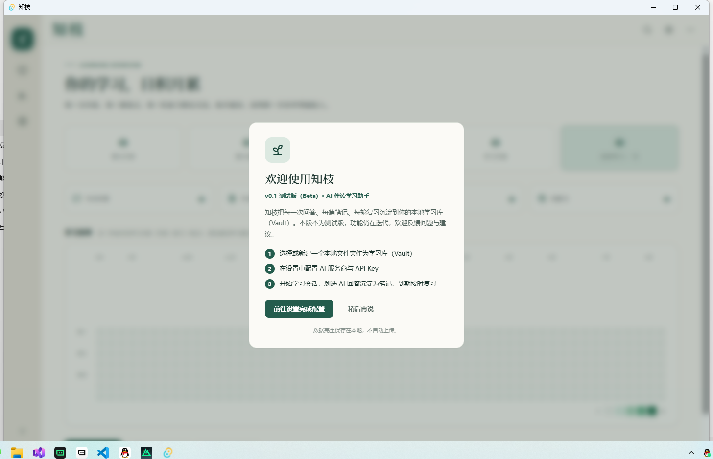
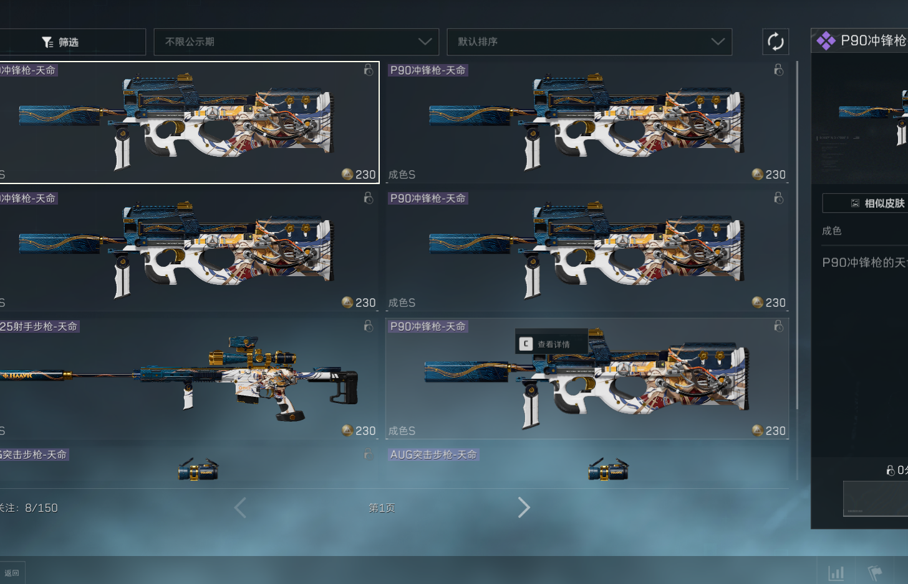
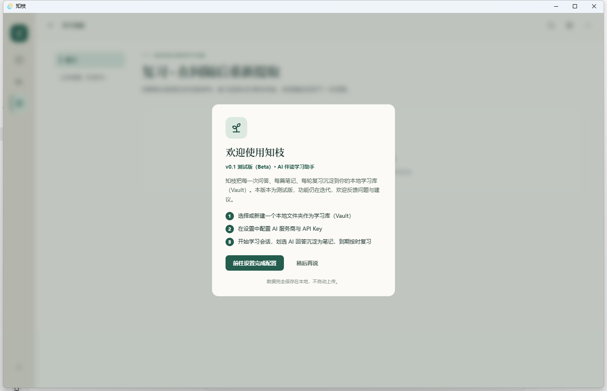
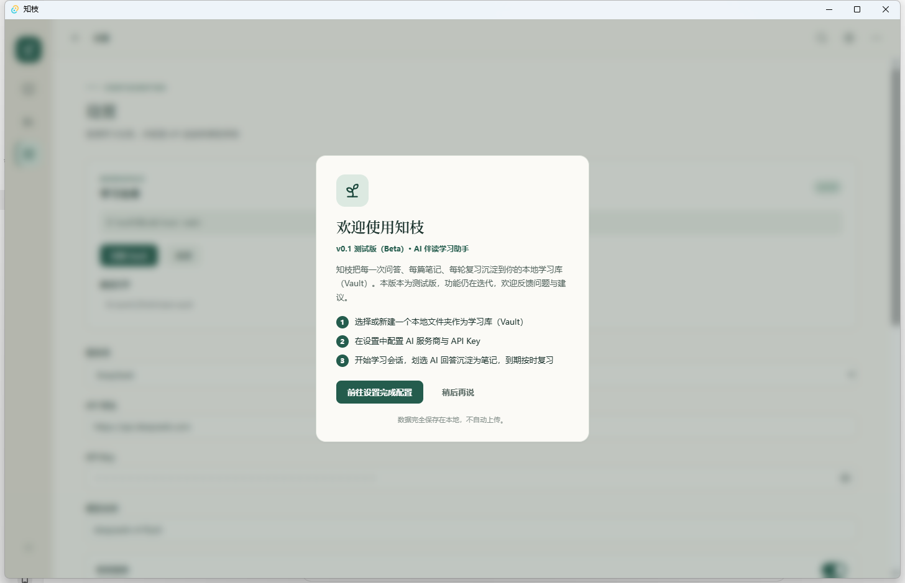

# 知枝（Study Thread）

**知枝**是一款 **AI 伴读桌面应用**：在学习会话中与 AI 对话，划选摘录沉淀原子笔记，通过间隔重复按时复习——把每一次问答、笔记与复习，沉淀成可检索、可回顾的学习资产。

> 当前版本：**v0.1 测试版（Beta）** · Windows 10 1809+（内置 WebView2）
>
> 数据完全**本地优先**：无账号、无云同步，你的学习数据始终只属于你自己。

---

## 为什么是知枝？

传统学习工具的痛点：看过就忘、笔记散落各处、复习靠自觉。知枝把「阅读 → 提问 → 提炼 → 复习」串成一个闭环：

1. **学**：与 AI 对话，把不懂的概念问清楚；
2. **摘**：在回答上划选关键内容，一键摘录成笔记；
3. **练**：笔记到期后自动进入复习队列，按记忆规律间隔重复，把短时记忆变成长期记忆。

每一步的产物都是**纯本地 Markdown 文件**，可检索、可导出、可备份，随时回顾你走过的学习路径。

---

## 核心功能

### 学习会话

与 AI 进行多轮对话式学习，支持主流模型服务商。会话以 Markdown 存储在 Vault 中，可随时回看、继续。

- 支持 **Anthropic (Claude)、OpenAI、DeepSeek、通义千问、智谱 (GLM)、Ollama（本地）** 及自定义服务商；
- 内置本地向量检索：参考资料 + 历史笔记可在对话中召回，回答更贴合你的知识库；
- 支持上传 PDF / Markdown / 图片作为参考资料，供对话检索引用。

### 划线摘录笔记

看到关键内容，不用复制粘贴到别处——直接在回答上**划选文本**，选择「摘录为笔记」，内容就变成一张原子笔记卡片。

摘录时可以补充你自己的理解与标签，让笔记不仅是摘抄，更是经过思考的沉淀。

### 划线分支会话

对话中产生新的疑问？对任意一段划线内容选择「分叉」，就能**从这条线索展开一条新的分支会话**，在分支里继续深挖追问，而不打断主线。

所有分支构成一棵会话树，随时回到任意节点继续学习，深度思考一目了然。

### 原子笔记

笔记以「一张卡片一件事」的原子形式组织：

- 含**类型、标签、原文摘录**与**你的理解**；
- 笔记之间可通过 Markdown 双向链接互相引用；
- 全部为 Markdown 文件，存放在 `<Vault>/notes/`，兼容任意 Markdown 工具编辑。

### 间隔复习系统

到期笔记按记忆曲线自动进入复习队列：

- 支持**经典间隔算法**与 **FSRS 个性化算法**两套调度；
- 复习时按笔记内容自动出题，支持**六类题型**（填空、问答、判断等），从不同角度检验记忆；
- 无 API Key 时仍可进入**原文模式**，直接对照笔记原文复习。

### 学习地图与学习总览

- **学习地图**：集中处理到期复习，查看复习节奏与学习进度；
- **学习总览**（主界面）：累计问答 / 复习 / 笔记数、连续学习天数、学习频率格子图——学了什么、学了多少，一目了然。

### 本地优先的 Vault

知枝的全部数据都在**你自己的本地文件夹（Vault）**里：

| 数据类型 | 位置 |
|----------|------|
| 笔记（Markdown） | `<Vault>/notes/*.md` |
| 学习会话 / 分支 | `<Vault>/sessions/*.md` |
| 参考资料 | `<Vault>/references/` |
| 复习队列、会话树等元数据 | `<Vault>/.study-thread/` |

- 复制 Vault 文件夹 = 完整备份；卸载应用不会删除 Vault；
- 对话内容仅在你选择的 LLM 服务商处处理，知枝本身不收集、不上传任何学习数据。

### 常用快捷键

| 快捷键 | 动作 |
|--------|------|
| `Ctrl + N` | 新建会话 |
| `Ctrl + B` | 打开资料库 |
| `Ctrl + H` | 打开学习地图 |
| `Ctrl + ,` | 打开设置 |

---

## 界面预览

### 学习总览（主界面）

累计学习数据、连续天数与学习频率一目了然。



### 学习会话

与 AI 对话学习，支持划选摘录与分支追问。



### 资料库（原子笔记）

以卡片形式浏览、检索你的原子笔记。



### 学习地图（复习中心）

集中处理到期复习，查看学习节奏。



### 设置

配置 Vault、AI 服务商与复习算法等。



### 待补充截图

以下功能涉及交互操作，暂由维护者手动截图补充（截图后替换下方占位标记即可）：

- **划线摘录演示**：在 AI 回答上划选文本 → 弹出「摘录为笔记」菜单 → 生成原子笔记卡片。建议截 2–3 张步骤图，存放至 `docs/screenshots/`。
- **划线分支会话演示**：对划线内容分叉 → 展开新分支会话。建议存放至 `docs/screenshots/`。
- **复习答题界面**：复习任务进入后的出题与答题页（可展示填空 / 问答 / 判断等题型）。

<!-- 占位符说明：将上述截图放入 docs/screenshots/ 后，在本节下方插入
      并更新说明文字即可。 -->

---

## 数据与隐私

- **不自动上传**：笔记、会话、参考资料、复习记录均保存在本地 Vault；
- **对话内容**仅在你配置的 LLM 服务商处处理，请留意各家服务的隐私政策；
- **API Key** 保存在应用本地存储中，请勿在共享设备上使用；
- **备份**：复制 Vault 文件夹即可完整备份全部学习数据。

---

## 快速开始（开发）

```bash
cd study-thread
npm install
npm run tauri dev
```

安装使用请见 [用户手册](docs/user-guide.md)，环境准备与打包分发请见 [运行与打包指南](docs/RUN.md)。

## 文档

| 文档 | 读者 | 说明 |
|------|------|------|
| [用户手册](docs/user-guide.md) | 最终用户 | 安装、快速上手、核心概念、数据与隐私、FAQ |
| [运行与打包指南](docs/RUN.md) | 开发者/维护者 | 环境准备、开发运行、打包构建、安装包分发 |
| [开发设计文档](docs/DEVELOPMENT.md) | 开发者 | 产品设计、功能规格 |
| [Code Wiki](docs/code-wiki/README.md) | 开发者 | 代码实现角度的模块文档 |
| [发布计划](docs/v0.1-release-plan.md) | 维护者 | v0.1 测试版发布评审与待办存档 |
| [更新日志](CHANGELOG.md) | 所有人 | 版本迭代记录 |

## 仓库结构

```
docs/             # 文档（用户手册 / 运行指南 / 开发文档 / code-wiki / 发布计划）
scripts/          # 开发辅助脚本（窗口恢复、截图等）
study-thread/     # 应用主体（前端 Vue 3 + Rust 后端 Tauri v2）
```

## 许可证

[Apache-2.0](LICENSE) © 2026 Asahiiiasd。允许自由使用、修改与分发（含商用），需保留版权声明与许可证文本。

> 说明：本项目为 AI 辅助生成代码，借鉴了 Obsidian（Vault + Markdown 双向链接）与对话式智能导师等产品的**设计理念**，源码为原创。若后续发现混入受 GPL 约束的第三方代码片段，将单独替换并在此说明。
